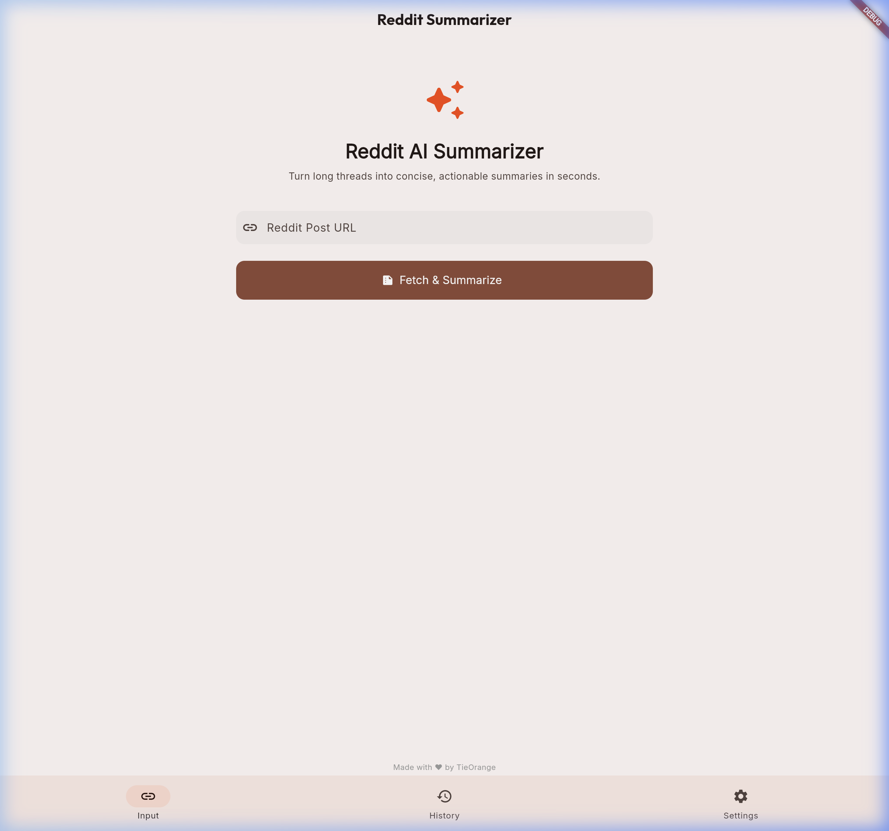
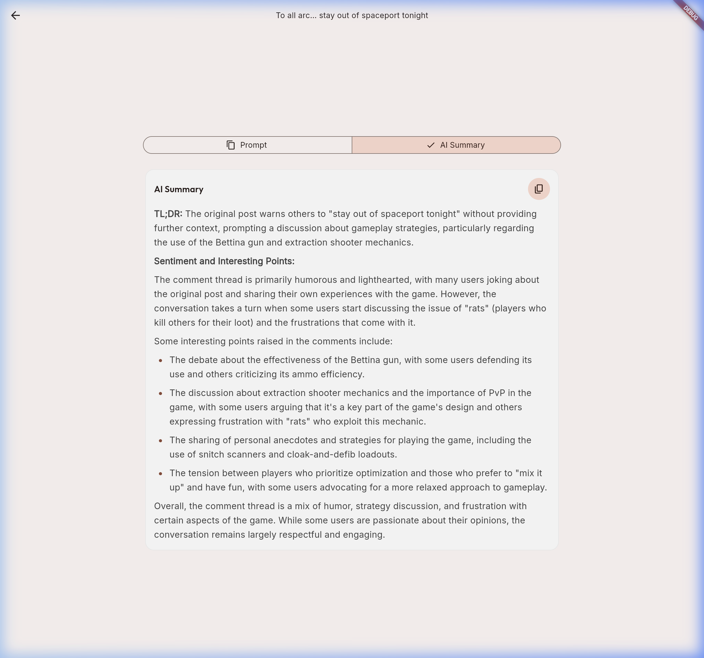
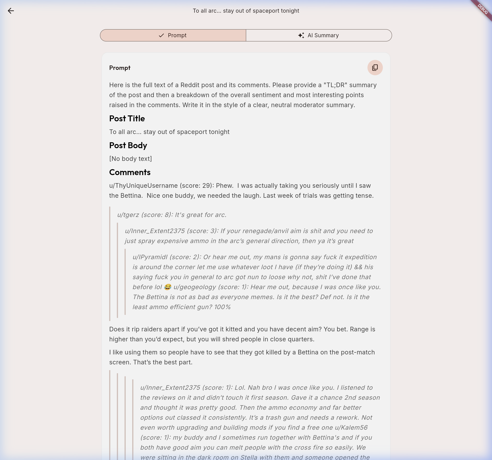

# 🤖 Reddit AI Summarizer

[](https://flutter.dev)
[](https://dart.dev)
[](https://opensource.org/licenses/MIT)

**Reddit AI Summarizer** is a Flutter web app that turns long, noisy Reddit threads into clear, actionable AI-generated summaries — powered by SambaNova's Llama 3.3 70B model.

🌐 **Live at:** [reddit-ai-summarizer.netlify.app](https://reddit-ai-summarizer.netlify.app)

---

## ✨ Features

- 📝 **Smart Summarization** — Get the gist of any Reddit post and its comments in seconds
- 📄 **Markdown Rendering** — Rich text display for AI summaries and formatted prompts
- 🕓 **History** — Browse previously summarized posts
- 🌗 **Dark Mode** — Seamless light/dark theme switching
- 🌐 **Web Ready** — CORS-free via a Cloudflare Worker proxy

---

## 📸 Screenshots

<p align="center">
  
  <br>
  <em>The landing page where you can input a Reddit URL.</em>
</p>

<br>

<p align="center">
  
  <br>
  <em>The generated AI summary with rich Markdown formatting and premium typography.</em>
</p>

<br>

<p align="center">
  
  <br>
  <em>The prompt tab showing the collected thread data and comments.</em>
</p>

---

## 🏗️ Architecture

All network requests are proxied through a **Cloudflare Worker** (`reddit-proxy.tieorange.workers.dev`) to avoid CORS issues:

- `/reddit?path=...` — proxies Reddit JSON API requests
- `/ai` — proxies SambaNova AI completion requests

The app is deployed on **Netlify** with a Netlify Edge Function retained for future use.

---

## 🚀 Running Locally

### Prerequisites

- [Flutter SDK](https://docs.flutter.dev/get-started/install) 3.22.0+
- A [SambaNova](https://sambanova.ai) API key

### Web

```bash
flutter run -d chrome --dart-define=AI_API_KEY=your_api_key_here
```

### Mobile

```bash
flutter run --dart-define=AI_API_KEY=your_api_key_here
```

---

## 🛠️ Deployment

### Build

```bash
flutter build web --release --dart-define=AI_API_KEY=your_api_key_here
```

### Deploy to Netlify

```bash
npx netlify deploy --prod --dir=build/web
```

### Deploy Cloudflare Worker

```bash
cd cloudflare-worker && wrangler deploy
```

---

## 🛠️ Tech Stack

- **Framework**: [Flutter](https://flutter.dev)
- **State Management**: [flutter_bloc](https://pub.dev/packages/flutter_bloc)
- **Networking**: [Dio](https://pub.dev/packages/dio)
- **Routing**: [go_router](https://pub.dev/packages/go_router)
- **Markdown**: [flutter_markdown_plus](https://pub.dev/packages/flutter_markdown_plus)
- **Error Handling**: [fpdart](https://pub.dev/packages/fpdart)
- **Proxy**: [Cloudflare Workers](https://workers.cloudflare.com)
- **Hosting**: [Netlify](https://netlify.com)

---

## 📂 Project Structure

```text
lib/
├── core/               # Theme, networking, models, storage
├── features/
│   ├── input/          # URL input & Reddit fetching
│   ├── output/         # AI summary display
│   ├── history/        # Past summaries
│   └── settings/       # API key & model config
└── router/             # GoRouter configuration
cloudflare-worker/      # CORS proxy worker
netlify/edge-functions/ # Netlify edge functions
```

---

## 📄 License

Distributed under the MIT License. See `LICENSE` for more information.

---

<p align="center">
  Made with ❤️ by TieOrange
</p>
